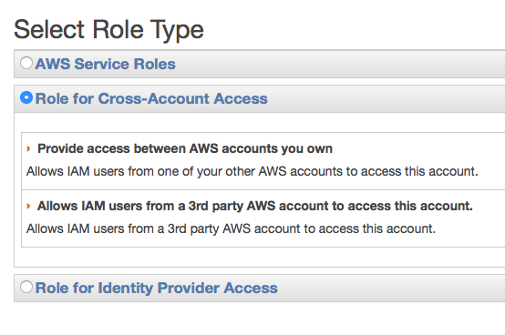

# Amazon Kinesis Cross-Account Client Java
This example application uses the official [Amazon Kinesis Client Library for Java](http://docs.aws.amazon.com/streams/latest/dev/kinesis-record-processor-implementation-app-java.html).  We have simply added support for cross-account access.

Cross-account access is when, in our case, The Washington Post has a Kinesis stream they want to share with an [ARC](http://www.arcpublishing.com) customer.  The Washington Post creates an IAM role that our customer can assume to access our Kinesis stream.

## ARC Customer - Kinesis Consumer Example
If you are an ARC customer and have been given a Kinesis stream with all your stories, images, videos, then this sample is for you!

This Kinesis stream is populated with the following information:
* [Stories](https://github.com/washingtonpost/ans-schema/blob/master/src/main/resources/schema/ans/0.5.7/content_operation.json)
* [Images](https://github.com/washingtonpost/ans-schema/blob/master/src/main/resources/schema/ans/0.5.7/image_operation.json)
* [Videos](https://github.com/washingtonpost/ans-schema/blob/master/src/main/resources/schema/ans/0.5.7/video_operation.json)

## Setup
### Step 1 - ARC Customer
Please tell us your AWS account id.  We need this in step 2.

### Step 2 - The Washington Post
We need to create an IAM User that you can assume.

In the AWS console create a new IAM role.
* Select "Role for Cross-Account Access"
* Then "Allows IAM users from a 3rd party AWS account to access this account."
* Add the Account ID only.  Don't add the External ID, this is not supported by the AWS Kinesis Client yet.




Use this as an example policy.  It uses the ARN from the Kinesis stream.

Example: arn:aws:iam::397853141546:role/kinesis-staging-external

Trust relationship:
```
{
  "Version": "2012-10-17",
  "Statement": [
    {
      "Effect": "Allow",
      "Principal": {
        "AWS": "arn:aws:iam::676590747184:root"
      },
      "Action": "sts:AssumeRole"
    }
  ]
}
```
Policy

```
{
    "Version": "2012-10-17",
    "Statement": [
        {
            "Sid": "Stmt1475084675000",
            "Effect": "Allow",
            "Action": [
                "kinesis:DescribeStream",
                "kinesis:GetShardIterator",
                "kinesis:GetRecords"
            ],
            "Resource": [
                "arn:aws:kinesis:us-east-1:397853141546:stream/com.arcpublishing.staging.content.ans"
            ]
        }
    ]
}
```

### Step 3 - ARC Customer
Get the IAM Role ARN and Kinesis stream name from The Washington Post.

Use the Kinesis stream name to populate the "KINESIS_STREAM_NAME" environment variable in [docker-compose.yml](docker-compose.yml).

Use the IAM Role to populate the "AWS_ROLE_ARN" environment variable in [docker-compose.yml](docker-compose.yml).

Create an IAM user in your account that can assume the IAM role in The Washington Post account.

After creating the IAM user attach a policy that grants access to the Securty Token Service.  Use the role ARN The Washington Post provided as the Resource.


Example policy:
```
{
    "Version": "2012-10-17",
    "Statement": [
        {
            "Sid": "Stmt1475158944000",
            "Effect": "Allow",
            "Action": [
                "sts:*"
            ],
            "Resource": [
                "arn:aws:iam::397853141546:role/kinesis-staging-external"
            ]
        },
         {
             "Sid": "Stmt1475084967000",
             "Effect": "Allow",
             "Action": [
                 "dynamodb:CreateTable",
                 "dynamodb:DescribeTable",
                 "dynamodb:DeleteItem",
                 "dynamodb:GetItem",
                 "dynamodb:PutItem",
                 "dynamodb:Scan",
                 "dynamodb:UpdateItem"
             ],
             "Resource": [
                 "*"
             ]
         },
         {
             "Sid": "Stmt1475085048000",
             "Effect": "Allow",
             "Action": [
                 "cloudwatch:PutMetricData"
             ],
             "Resource": [
                 "*"
             ]
         }
    ]
}
```

Now use your IAM user credentials to populate the AWS_ACCESS_KEY_ID and AWS_SECRET_ACCESS_KEY found in [docker-compose.yml](docker-compose.yml).  Additionally, ensure that the AWS_REGION value in [docker-compose.yml](docker-compose.yml) is set appropriately.

## Run Sample
Install and setup [Docker Compose](https://docs.docker.com/compose/).

Run the following commands to build and run this docker container.
```
docker-compose build
docker-compose up
```