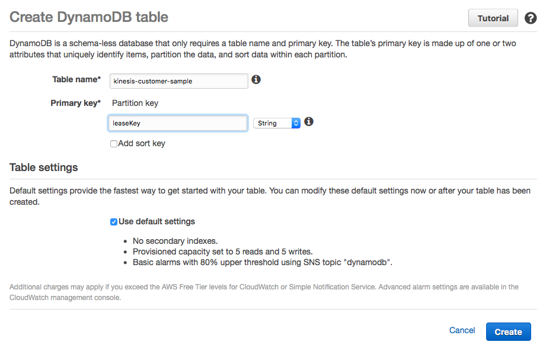

# ARC Customer - Kinesis Consumer Example
If you are an ARC customer and have been given a Kinesis stream with all your stories, images, videos, then this sample is for you!

This sample consumes the the "staging" customer data.  The following Kinesis stream is on the ARC AWS account: com.arcpublishing.staging.content.ans

This Kinesis stream is populated with the following information:
* [Stories](https://github.com/washingtonpost/ans-schema/blob/master/src/main/resources/schema/ans/0.5.7/content_operation.json)
* [Images](https://github.com/washingtonpost/ans-schema/blob/master/src/main/resources/schema/ans/0.5.7/image_operation.json)
* [Videos](https://github.com/washingtonpost/ans-schema/blob/master/src/main/resources/schema/ans/0.5.7/video_operation.json)

## Setup
### Step 1
We need to create a DynamoDB table.

The name of the table has to match the "applicationName" found in [properties/kcl.properties](properties/kcl.propertis).  So pick an applicationName, create the DynamoDB table, and let the customer know what it is.

In the AWS console create a DynomoDB table with "leaseKey" as the Primary key.


### Step 2
We need to create an IAM User.

Use this as an example policy.  It uses the ARN from the Kinesis stream and the DynamoDB table.

```
{
    "Version": "2012-10-17",
    "Statement": [
        {
            "Sid": "Stmt1475084675000",
            "Effect": "Allow",
            "Action": [
                "kinesis:DescribeStream",
                "kinesis:GetShardIterator",
                "kinesis:GetRecords"
            ],
            "Resource": [
                "arn:aws:kinesis:us-east-1:397853141546:stream/com.arcpublishing.staging.content.ans"
            ]
        },
        {
            "Sid": "Stmt1475084967000",
            "Effect": "Allow",
            "Action": [
                "dynamodb:CreateTable",
                "dynamodb:DescribeTable",
                "dynamodb:DeleteItem",
                "dynamodb:GetItem",
                "dynamodb:PutItem",
                "dynamodb:Scan",
                "dynamodb:UpdateItem"
            ],
            "Resource": [
                "arn:aws:dynamodb:us-east-1:397853141546:table/kinesis-customer-sample"
            ]
        },
        {
            "Sid": "Stmt1475085048000",
            "Effect": "Allow",
            "Action": [
                "cloudwatch:PutMetricData"
            ],
            "Resource": [
                "*"
            ]
        }
    ]
}
```

### Step 3
Give the customer the DynamoDB table name so they can populate the "applicationName" found in [properties/kcl.properties](properties/kcl.propertis).  Also give the customer the IAM User credentials so they can populate AWS_ACCESS_KEY_ID and AWS_SECRET_ACCESS_KEY found in [docker-compose.yml](docker-compose.yml).